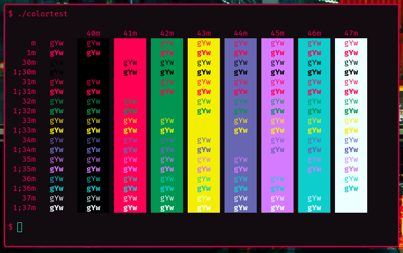

# Cyberpunk theme for [kitty](https://sw.kovidgoyal.net/kitty/)
Cyberpunk colorscheme for kitty



This is based on the [Cyberpunk VIM Colorscheme](https://github.com/thedenisnikulin/vim-cyberpunk) by [thedenisnikulin](https://github.com/thedenisnikulin)

## Install
Download the theme and include it in your kitty config file:
```
$ curl -o ~/.config/kitty/cyberpunk.conf https://raw.githubusercontent.com/jandre953/kitty-cyberpunk/master/cyberpunk.conf
```

Append the following line to your config file:
```
include ./cyberpunk.conf
```

## License

[MIT License](./LICENSE)
